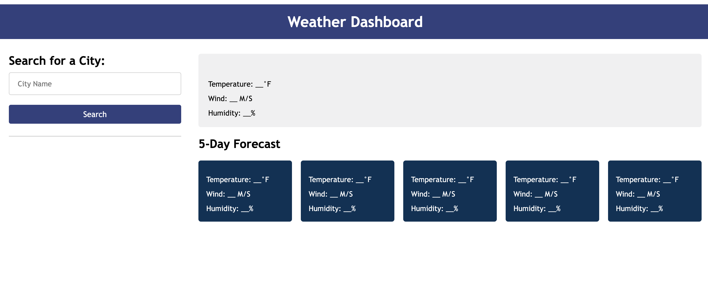

# Rain-or-Shine
A 5 day weather dashboard

## Description
Using a third party API to create a weather dashboard that will display the current weather as well as the 5 day forecast of a searched city.   

## Table of Contents 

- [Installation](#installation)
- [Usage](#usage)
- [Credits](#credits)
- [License](#license)

## Installation

There is no installation required for this project. Please use the link in the usage section (below) to view the finished product. 

## Usage

https://sharareh18.github.io/rain-or-shine/

## Credits

Online Tutorials and Resources:

-  How to Use the JavaScript Fetch API to Get Data?: https://www.geeksforgeeks.org/how-to-use-the-javascript-fetch-api-to-get-data/
-  Fetch Image Data From API in Javascript:  https://medium.com/geekculture/fetch-image-data-from-api-in-javascript-9a7f5f3048ab
-  Display date:  https://day.js.org/docs/en/display/display
-  Weather icons:  https://openweathermap.org/weather-conditions
-  How to Use API Keys:  https://coding-boot-camp.github.io/full-stack/apis/how-to-use-api-keys

University of California Irvine Full Stack Development Bootcamp 2023 Resources:

-  UCI Bootcamp Slack Study Group:  https://ucivirtfsfpt0-bgx3057.slack.com/archives/C056LT7DUUF
-  UCI Web Development Tutor Jacob Carver:  https://github.com/jacobcarver
-  UCI Bootcamp Module 6 Server Side APIs : activities 8, 14, 16, 18, 20, 24, 27 

## License

None
